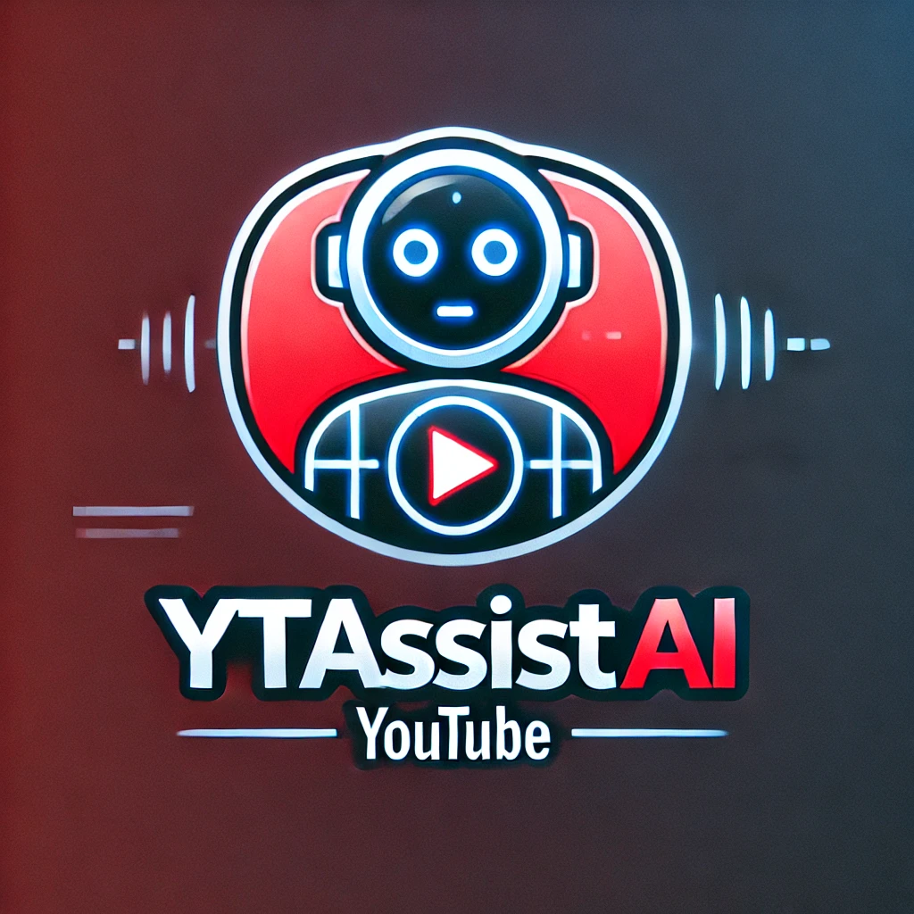
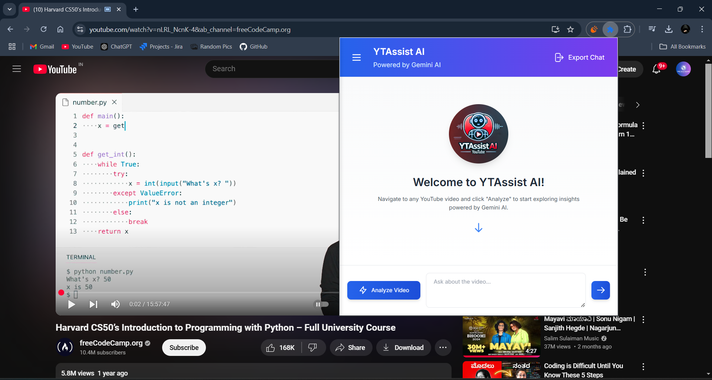
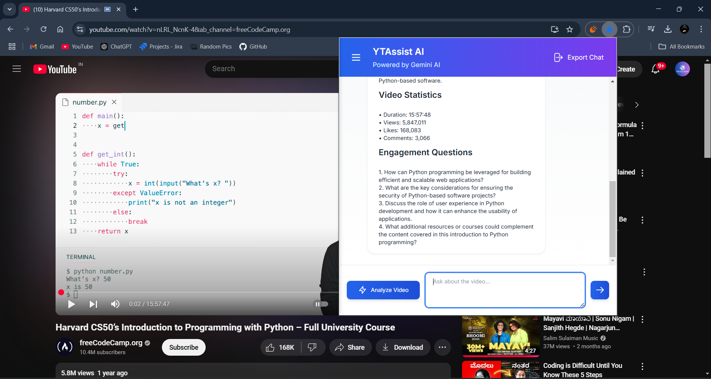
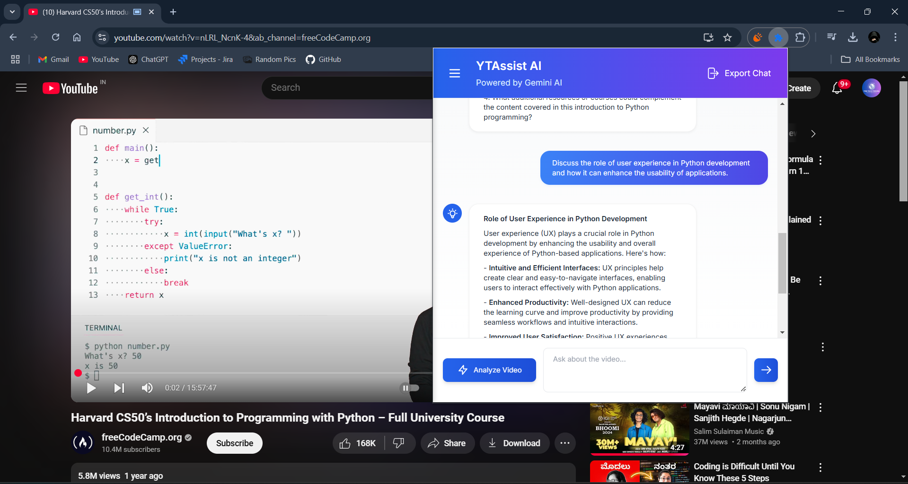
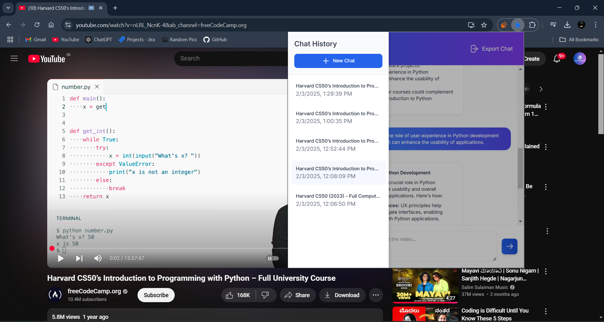
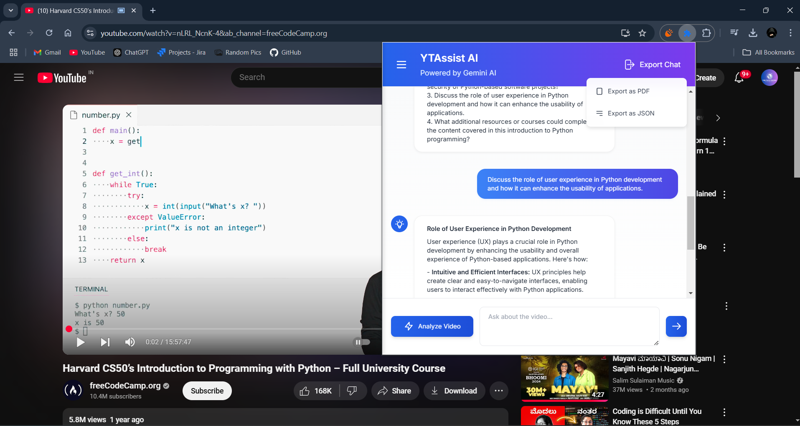
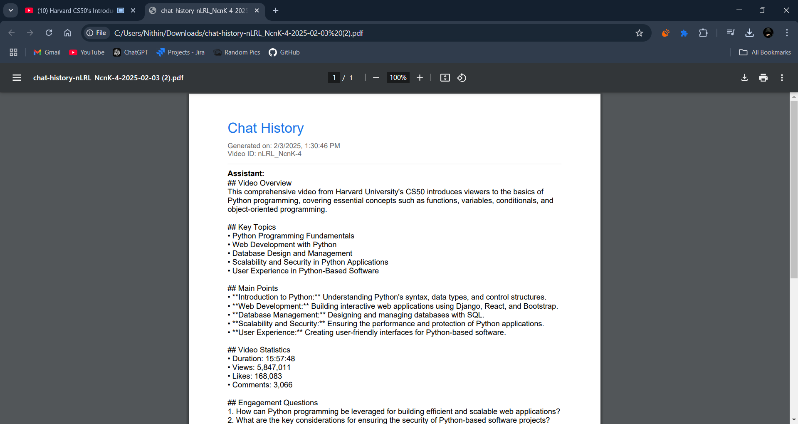

# YTAssist AI - YouTube Video Analysis Extension 🚀



YTAssist AI is a powerful Chrome extension that leverages Google's Gemini AI to provide intelligent analysis and insights for YouTube videos. Get instant summaries, key points, and engage in AI-powered conversations about video content.

[](https://opensource.org/licenses/MIT)
[](https://chrome.google.com/webstore)
[](https://deepmind.google/technologies/gemini/)

## 🎥 Demo

<video src="https://github.com/nithin-developer/YTAssist-AI/raw/refs/heads/main/screenshots/demo-video.mp4" controls></video>

## 📸 Screenshots














## ✨ Features


- 🤖 AI-powered video analysis
- 💡 Instant video summaries and key points
- 💬 Interactive chat with AI about video content
- 📊 Video statistics and insights
- 💾 Export conversations (PDF/JSON)
- 🎨 Modern, responsive UI with dark mode support
- 🔒 Secure data encryption
- 📱 Cross-platform compatibility

## 🛠️ Installation

1. Clone the repository:
bash
git clone https://github.com/yourusername/ytassist-ai.git

2. Navigate to `chrome://extensions/` in Chrome
3. Enable "Developer mode"
4. Click "Load unpacked"
5. Select the extension directory

### API Configuration

1. Update a `background.js` file in the root directory, in a constructor function:

```javascript
    this.API_KEY = "your-api-key";
    this.YOUTUBE_API_KEY = "your-api-key";

```

2. Obtain API keys:
   - [Get Gemini API Key](https://deepmind.google/technologies/gemini/)
   - [Get YouTube Data API Key](https://developers.google.com/youtube/v3/getting-started)

## 🚀 Usage

1. Navigate to any YouTube video
2. Click the YTAssist AI extension icon
3. Click "Analyze Video"
4. View analysis and engage with the AI chat
5. Export conversations as needed

## 🔧 Technical Details

### Technologies Used

- Frontend:
  - HTML5/CSS3
  - JavaScript (ES6+)
  - Tailwind CSS
  - Chrome Extension APIs

- APIs:
  - Google Gemini AI API
  - YouTube Data API v3

- Libraries:
  - jsPDF (PDF generation)
  - Tailwind CSS

### Security Features

- End-to-end encryption for stored data
- Secure API key handling
- XSS protection
- Content Security Policy

### Storage

- Chrome Storage API for persistence
- Encrypted local storage
- Cache management for performance

## 🤝 Contributing

1. Fork the repository
2. Create your feature branch:
```bash
git checkout -b feature/AmazingFeature
```
3. Commit your changes:
```bash
git commit -m 'Add some AmazingFeature'
```
4. Push to the branch:
```bash
git push origin feature/AmazingFeature
```
5. Open a Pull Request

## 📝 License

This project is licensed under the MIT License - see the [LICENSE](LICENSE) file for details.

## 🙏 Acknowledgments

- Google Gemini AI
- YouTube Data API
- Chrome Extensions Team
- Open-source community

## 📞 Support

- Create an [Issue](https://github.com/nithin-developer/ytassist-ai/issues)
- Email: nithindeveloper07@gmail.com
- Twitter: [@buildwithnithin](https://twitter.com/buildwithnithin)

## 🔮 Future Plans

- [ ] Multi-language support
- [ ] Video timestamp integration
- [ ] Collaborative analysis

- [ ] Custom analysis templates
- [ ] Integration with more AI models

## 🏗️ Project Structure

```
ytassist-ai/
├── assets/
│   ├── icons/
│   ├── images/
│   ├── scripts/
│   │   └── jspdf.debug.js
│   │   └── popup.js
│   └── styles/
│       └── style.css
├── screenshots/
├── background.js
├── manifest.json
├── popup.html
└── README.md
```


## 💻 Development

### Prerequisites

- Node.js 14+
- Chrome Browser
- API keys (Gemini & YouTube)

## 🔄 Version History

- v1.0.0 (2025-02-03)
  - Initial release
  - Core analysis features
  - Chat functionality
  - Export options

## 📊 Analytics

Track usage and performance metrics through:
- Chrome Extension Analytics
- Custom event tracking
- Error monitoring

## 🌟 Star History

[](https://star-history.com/#nithin-developer/ytassist-ai&Date)

---

<p align="center">Made with ❤️ by Nithin</p>
